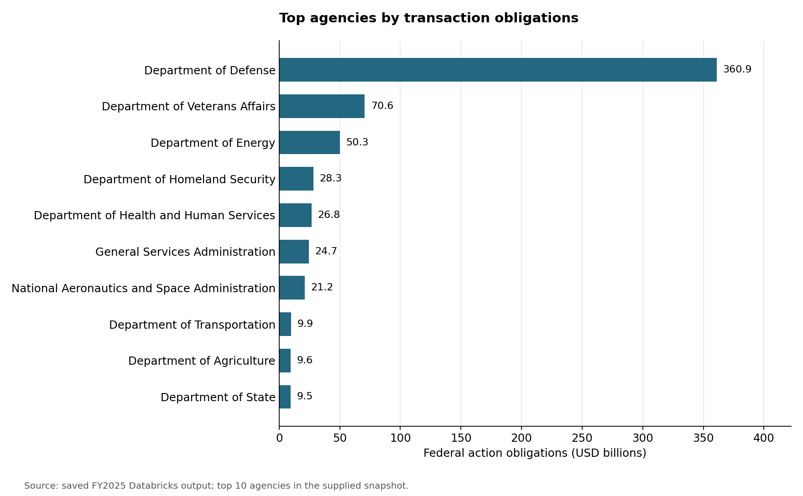
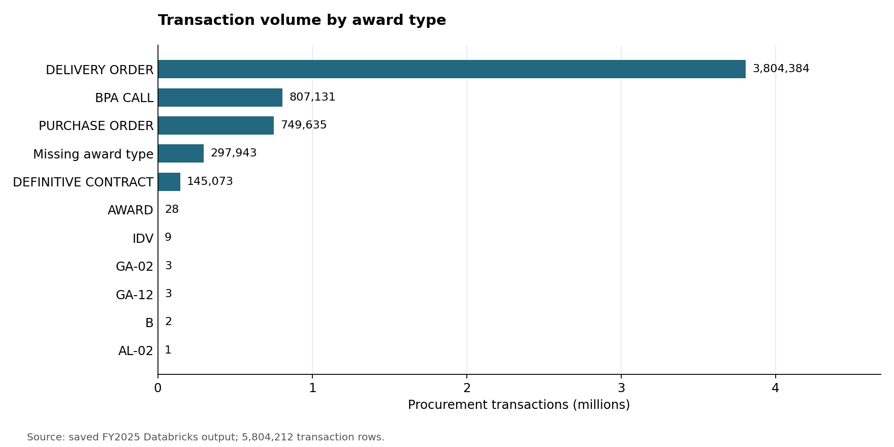

# U.S. Federal Procurement Analytics

**Databricks · PySpark · SQL · Data profiling · KPI reporting**

I prepared federal procurement data for analysis and defined SQL metrics to examine spending and transaction activity. My contribution to the team project covered multi-file ingestion, column profiling, analytical-table preparation, and KPI definitions.

**Julio Hernandez** · [GitHub](https://github.com/akaitow) · [LinkedIn](https://www.linkedin.com/in/julio-hernandez-88411b2b6)

## Project at a glance

| Item | Scope |
|---|---|
| Business question | Which agencies account for the largest obligations, and how is procurement activity distributed? |
| Data | FY2025 federal contract transaction snapshot referenced in the original USAspending project |
| Scale in saved outputs | 5,804,212 transaction records and 297 source columns |
| Preparation result | 48-column analytical projection, with all 5,804,212 rows retained |
| My contribution | Bronze-layer preparation and SQL KPI definitions |
| Evidence | Original saved Databricks query outputs, extracted aggregates, and reproducible charts |

One row represents a **procurement transaction**, not necessarily one distinct contract. The figures describe the supplied snapshot. They have not been independently reconciled to government-wide totals.

## Results

The original queries reported **$653.865 billion in summed federal action obligations**. Obligations are commitments, not cash outlays. Negative transaction adjustments remain included.



The Department of Defense leads the saved agency ranking at approximately **$360.9 billion**. Agency totals can help prioritize further analysis of where funds are committed; they do not establish efficiency or procurement performance.



Delivery orders account for **3,804,384 transaction rows**, approximately **65.5%** of the snapshot. Missing award-type values are included in the chart and denominator.

The saved award-type output also contains rare unexpected labels such as `GA-02` and `AL-02`. These need source/schema and CSV-parsing checks before the results are used for an operational decision. The charts reproduce the original outputs; they do not certify their source quality.

## What I built

- **Data ingestion:** Read multiple CSV parts into a Spark DataFrame and persisted Databricks managed tables.
- **Data profiling:** Used SQL to count missing values and calculate dominant-value frequency, including `GROUP BY`, `UNION ALL`, `ROW_NUMBER`, and windowed sums.
- **Analytical preparation:** Applied documented column-selection rules while preserving the original source table.
- **KPI definitions:** Wrote transaction-level SQL for obligations, activity volume, agency rankings, competition categories, award types, and industries.
- **Business interpretation:** Connected each metric to a question and documented limitations in its denominator, grain, or source coverage.

## Explore the work

| Notebook | What to inspect | Execution environment |
|---|---|---|
| [01 Data preparation](notebooks/01_data_preparation.ipynb) | Original ingestion and profiling logic with saved outputs | Databricks and original CSVs |
| [02 KPI analysis](notebooks/02_kpi_analysis.ipynb) | Six original SQL calculations with reviewed descriptions | Databricks and prepared table |
| [03 Results showcase](notebooks/03_results_showcase.ipynb) | Charts and consistency checks using included aggregates | Local Python or Jupyter |

[Metric definitions](docs/metric_definitions.md) · [Reproduction instructions](docs/reproduce.md) · [Limitations and validation](docs/limitations.md) · [Data provenance](data/README.md)

## Reproduce the charts

The repository includes small aggregate CSV files, so viewing and regenerating the charts does not require the full source extract or a Databricks account.

```bash
python -m venv .venv
# macOS/Linux
source .venv/bin/activate
# Windows PowerShell: .venv\Scripts\Activate.ps1
python -m pip install -r requirements.txt
python scripts/run_showcase.py
```

This runs the Python cells of notebook 03 in order, saves its outputs, and regenerates both images. It does not rerun the Databricks queries. Follow the [Databricks instructions](docs/reproduce.md) to reproduce the source workflow.

## Team contribution and portfolio edition

The original project assigned bronze preparation and KPI definitions to **Julio**, silver/gold preparation and initial exploration to **Ricardo**, and machine learning to **Felipe**. This repository showcases Julio's portion; it does not claim authorship of teammates' work or include their implementations.

This portfolio edition adds documentation, aggregate exports, and a local chart notebook with AI assistance. The original SQL/PySpark calculations in notebooks 01 and 02 are retained, with presentation edits and a smaller selection of KPIs. The Databricks results are historical saved outputs; notebook 03 reproduces charts from those aggregates. See [validation boundaries](docs/limitations.md).
